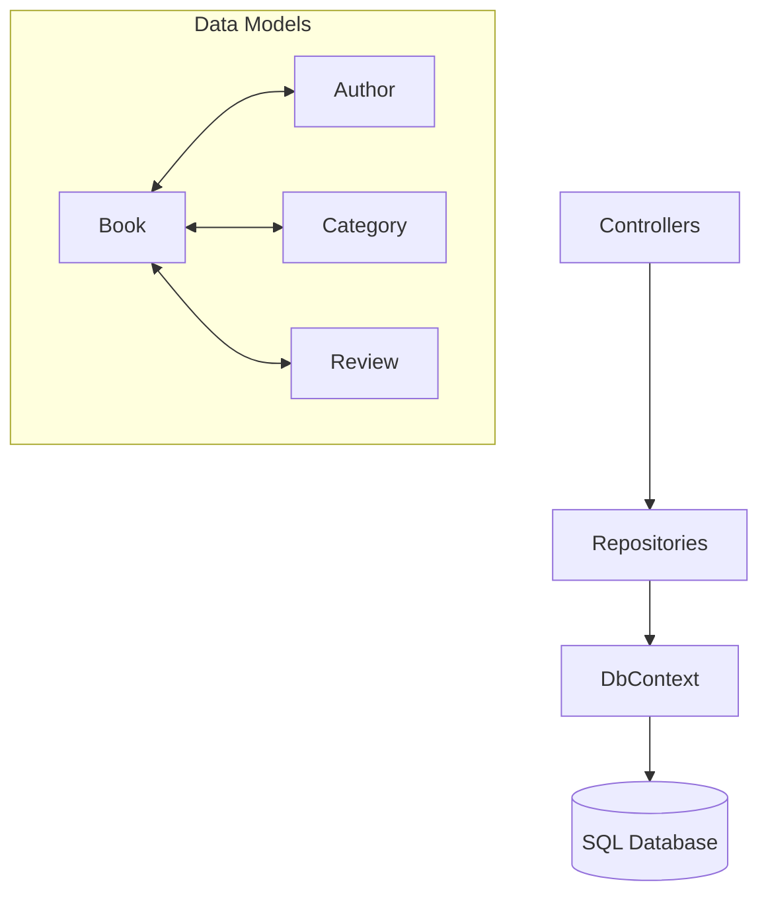

# 📚 Book Library System

<div align="center">
  


</div>

> A modern, feature-rich ASP.NET Core Web API for managing a book library with comprehensive book, author, category, and review management capabilities.

## ✨ Features

- 📖 **Complete Book Management** - Create, read, update, and delete books with all details
- 👩‍💻 **Author Tracking** - Link books to authors with biographical information
- 🏷️ **Category Organization** - Assign multiple categories to books
- ⭐ **Review System** - Store and retrieve book reviews with ratings
- 🔍 **Advanced Search** - Find books by title, author, or description using LINQ
- 📊 **Rating Analytics** - Calculate average ratings across books
- 📘 **API Documentation** - Auto-generated Swagger/OpenAPI documentation

## 🏗️ Architecture



## 📋 Database Schema

| Entity | Description | Relations |
|--------|-------------|-----------|
| 📕 **Book** | Core book information | Belongs to Author, Has many Categories, Has many Reviews |
| 👤 **Author** | Writer details with bio | Has many Books |
| 🏷️ **Category** | Genre classification | Has many Books |
| 💬 **Review** | User feedback and ratings | Belongs to Book |

## 🚀 Quick Start

### Prerequisites

- [.NET 6.0 SDK](https://dotnet.microsoft.com/download/dotnet/6.0) or newer
- [SQL Server](https://www.microsoft.com/en-us/sql-server/sql-server-downloads) (LocalDB or full version)
- [Visual Studio](https://visualstudio.microsoft.com/) / [VS Code](https://code.visualstudio.com/) or preferred IDE

### Installation in 5 Easy Steps

1. **Clone & Navigate:**
   ```bash
   git clone https://github.com/NickiMash17/BookLibrarySystem.git
   cd BookLibrarySystem
   ```

2. **Restore Packages:**
   ```bash
   dotnet restore
   ```

3. **Set Up Database:**
   ```bash
   dotnet ef database update
   ```

4. **Launch the API:**
   ```bash
   dotnet run
   ```

5. **Explore with Swagger:**
   ```
   https://localhost:7001/swagger/index.html
   ```

## 🔌 API Endpoints

### Book Operations

| Method | Endpoint | Description |
|--------|----------|-------------|
| `GET` | `/api/Books` | 📋 List all books |
| `GET` | `/api/Books/{id}` | 📕 Get book details |
| `GET` | `/api/Books/author/{id}` | 👤 Get author's books |
| `GET` | `/api/Books/category/{id}` | 🏷️ Get books by category |
| `GET` | `/api/Books/search?term={query}` | 🔍 Search books |
| `GET` | `/api/Books/ratings` | ⭐ Get books with ratings |
| `POST` | `/api/Books` | ➕ Add new book |
| `PUT` | `/api/Books/{id}` | 📝 Update book |
| `DELETE` | `/api/Books/{id}` | 🗑️ Delete book |

## 📂 Project Structure

```
BookLibrarySystem/
├── 🎮 Controllers/
│   └── BooksController.cs
├── 💾 Data/
│   ├── BookLibraryContext.cs
│   └── DbInitializer.cs
├── 📋 Models/
│   ├── Author.cs
│   ├── Book.cs
│   ├── BookCategory.cs
│   ├── Category.cs
│   └── Review.cs
├── 🔄 Repositories/
│   ├── BookRepository.cs
│   └── IBookRepository.cs
├── 🔀 Migrations/
├── ⚙️ appsettings.json
└── 🚀 Program.cs
```

## 🧠 Design Patterns Used

- **Repository Pattern** - Separation of data access logic
- **Dependency Injection** - Built-in .NET Core DI container
- **LINQ Query Objects** - For complex database queries with strong typing
- **Entity Framework Core** - ORM for database operations
- **OpenAPI/Swagger** - For automatic API documentation and testing

## 💡 Sample Usage

```csharp
// Get all books with ratings above 4.0
var highlyRatedBooks = await _context.Books
    .Include(b => b.Author)
    .Include(b => b.Reviews)
    .Where(b => b.Reviews.Average(r => r.Rating) >= 4.0)
    .ToListAsync();
```

## 🤝 Contributing

Contributions make the open-source community amazing! Follow these steps:

1. Fork the project
2. Create your feature branch (`git checkout -b feature/AmazingFeature`)
3. Commit changes (`git commit -m 'Add some AmazingFeature'`)
4. Push to branch (`git push origin feature/AmazingFeature`)
5. Open a Pull Request

## 📜 License

This project is licensed under the MIT License - see the [LICENSE](LICENSE) file for details.

---

<div align="center">
  <p>Made with ❤️ for book lovers and developers alike</p>
  <p>⭐ Star this repository if you find it useful! ⭐</p>
</div>